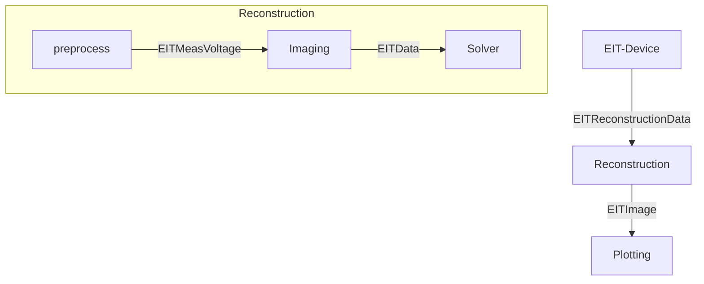
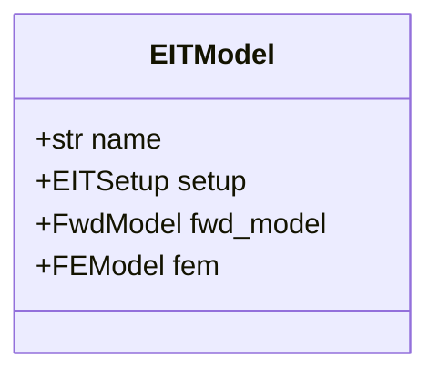
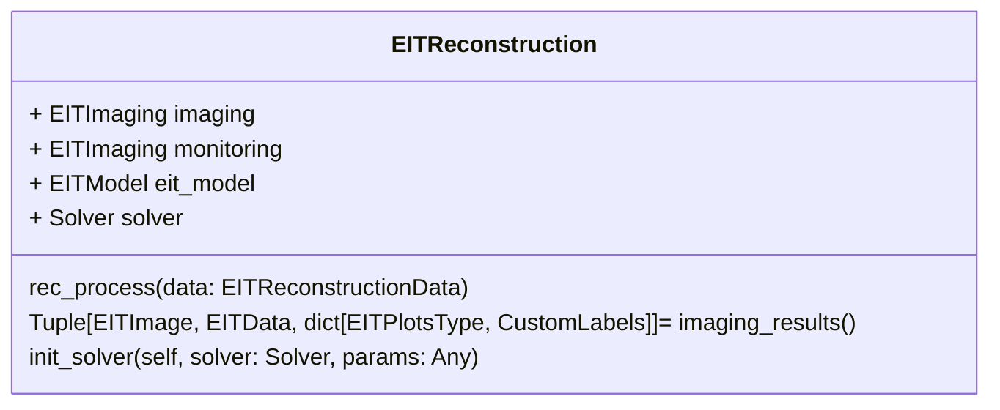

# eit_model

package to provide a global structure of models for Electrical Impedance Tomography

Note:
- TODO to refactor... 

## 1. Introduction

the structure models for Electrical Impedance Tomography is based on:
- the python package `pyeit` https://github.com/liubenyuan/pyEIT
- the matlab toolbox `EIDORS`  http://eidors3d.sourceforge.net/

### 1.1 Dependencies
### 1.2 Features
 - [ ] load data from `pyeit` model and return `pyeit` mesh model
 - [ ] load `EIDORS` fwd_model
 - [ ] plot 2d meshes
## 2. Installation
Only python based!...
## 3. Modules

### 3.1 Data
Gather main EIT dataclass used in that module which transport the neede data!

- EITImage, reconstruct EIT image data (based on an FEM model)
- EITData, data build out of the EITReconstructionData using EITmodel and Imaging
- EITReconstructionData, data send from an EIT-Device, is composed out of two frame of voltage measurements incl. some labeling (rawdata)
- EITMeasVoltage, data correspodning to the electrode voltages used to build the EITdata

### 3.2 Model

For the momment only model or env mat-file created using the App_EIDORS_ModelSim can be used to

basically it load all the data and those data can be used in python

the Setup is the same structure

fem is a simpler form of the fwd-model which is used. 

### 3.3 Imaging
The imaging allow to compute the eit data depending on the imaging type selected: absolut, time-, frequence-defference and theselected data part (real, image, magnitude, phase)

### 3.5 Reconstruction

Reconstruction allow you run a reconstruction by passing EITReconstructionData. befor you will need to set eit_model, solver and the imaging.

imaging results have to be called using imaging results methods

### 3.6 Solver
different solver can be easily implemented folowing the abstract class.
two solver pyeit and ai have been implemented

### 3.7 Plot

defie som plots used for eit monitoring etc...

### 3.8 Pyvista_plot/gui
implementation of a widget for 3D plotting of the Eit REconstruction model...

## 4. Contribute to `eit_model`.
## 5. Cite our work.

**If you find `eit_model` useful, please cite our work!**

